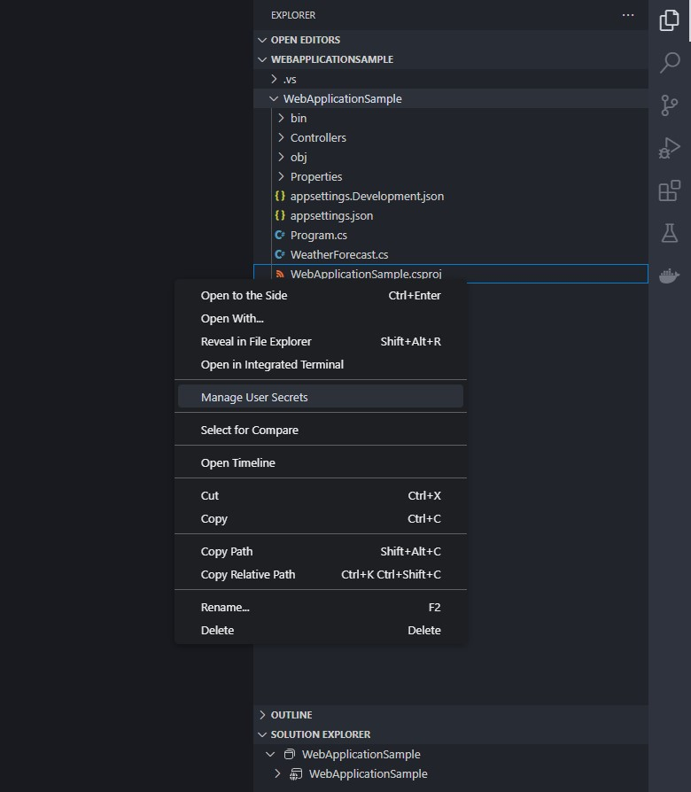

# User Secrets Management

View and manages user secretes for .NET Core/.NET5+ projects just like in Visual Studio.

## Features

Right click on your `.csproj`, `.fsproj` or `.vbproj` file and select `Manage User Secrets`.

It will open or create the `secret.json` file and update your project file if necessary.

## Requirements

This extension has the following dependencies:

* `uuid`: to generate a new GUID.

## Release Notes

### 1.0.0

Initial release

---
